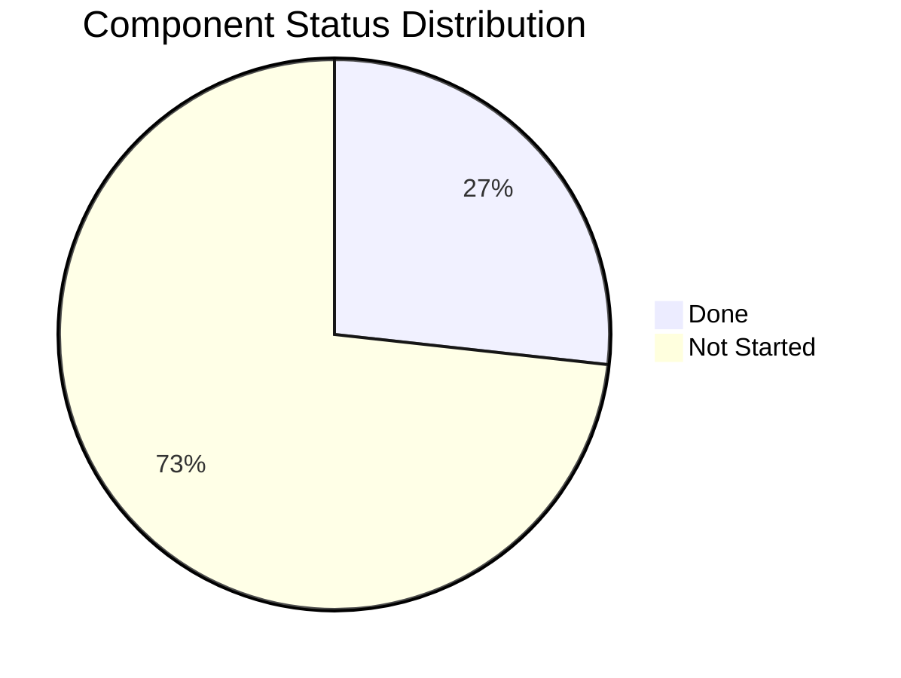
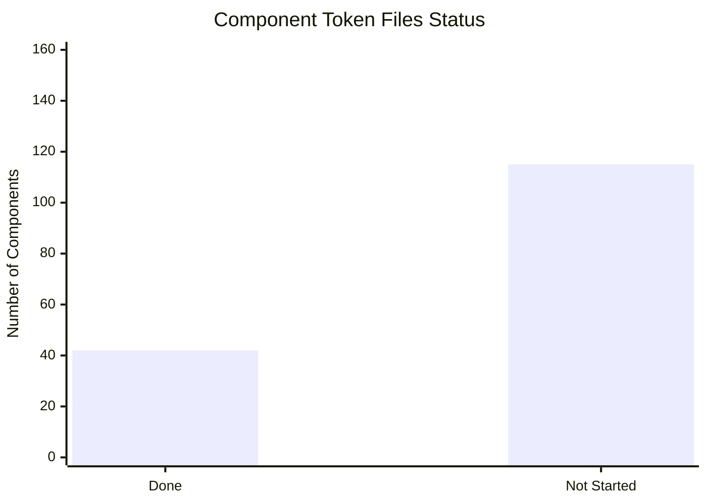
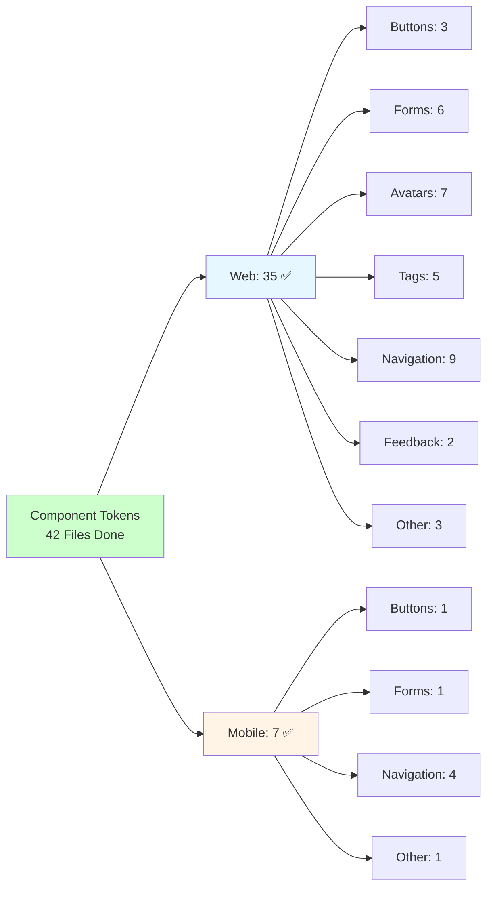

# HighRise Component Tokens - Project Status Tracker

## 📊 Project Overview
**Project**: HighRise Component Tokens Generation  
**Start Date**: Current  
**Target Completion**: 4 weeks  
**Current Phase**: Phase 2 - Component Token Generation (In Progress)  

## 🎯 Current Status Summary

### ✅ Completed (Infrastructure)
- [x] Project setup and documentation
- [x] Existing token analysis (3,140 primitive + 4,508 semantic tokens)
- [x] Component token template structure
- [x] Token generation automation scripts
- [x] File organization structure established

### ✅ Component Token Files Generated: **42 Files Complete**

**Web Components (35 files):**

**Core Interactive Components:**
- ✅ `button.json` - Primary button component
- ✅ `link-button.json` - Link-styled button  
- ✅ `action-icon.json` - Icon button
- ✅ `icon.json` - Base icon

**Form Components:**
- ✅ `input.json` - Input field
- ✅ `input-form.json` - Form input wrapper
- ✅ `textarea.json` - Textarea input
- ✅ `select.json` - Select dropdown
- ✅ `checkbox-element.json` - Checkbox
- ✅ `radio.json` - Radio button

**Avatar Components:**
- ✅ `avatar.json` - Base avatar
- ✅ `avatar-profile-photo.json` - Profile photo variant
- ✅ `avatar-company-icon.json` - Company icon variant
- ✅ `avatar-online-indicator.json` - Online indicator
- ✅ `avatar-add-button.json` - Add user button
- ✅ `avatar-with-label.json` - Avatar with name and description
- ✅ `avatar-group.json` - Avatar group component

**Tag Components:**
- ✅ `tag.json` - Base tag
- ✅ `tag-close.json` - Tag close button
- ✅ `tag-count.json` - Tag count indicator
- ✅ `tag-group.json` - Tag group component
- ✅ `badge-group.json` - Badge group component

**Navigation & Menu:**
- ✅ `tab.json` - Base tab
- ✅ `tab-item.json` - Tab item
- ✅ `dropdown-menu.json` - Dropdown container
- ✅ `dropdown-list-item.json` - Dropdown item
- ✅ `content-switcher.json` - Content switcher container
- ✅ `content-switcher-item.json` - Content switcher item
- ✅ `pagination.json` - Pagination component
- ✅ `pagination-item.json` - Pagination item
- ✅ `pagination-button-group.json` - Pagination button group

**Feedback:**
- ✅ `alert.json` - Alert component
- ✅ `tooltip.json` - Tooltip component

**Other Components:**
- ✅ `action-group.json` - Action group component
- ✅ `time-picker.json` - Time picker component

**Template:**
- ✅ `component-token-template.json` - Standard template for new components

**Mobile Components (7 files):**
- ✅ `button.json` - Mobile button component
- ✅ `input.json` - Mobile input field component
- ✅ `tab.json` - Mobile tab container component
- ✅ `tab-item.json` - Mobile tab item component
- ✅ `content-switcher.json` - Mobile content switcher container
- ✅ `content-switcher-item.json` - Mobile content switcher item
- ✅ `no-badge.json` - Mobile no badge component

### 📊 Remaining Component Status Summary

| Component | Sub/Base Components | Status |
|-----------|-------------------|---------|
| **Button** | Button | ✅ **Done** |
| | Link Button | ✅ **Done** |
| | Action Icon | ✅ **Done** |
| | Action Group | ⏳ **Not Started** |
| | | |
| **Icon** | Icon | ✅ **Done** |
| | Action Icon | ✅ **Done** |
| | |
| **Tag** | Tag | ✅ **Done** |
| | Tag x close | ✅ **Done** |
| | Tag count | ✅ **Done** |
| | Badge group | ⏳ **Not Started** |
| | Tag Group | ⏳ **Not Started** |
| | | |
| **Avatar** | Avatar | ✅ **Done** |
| | Avatar profile photo | ✅ **Done** |
| | Avatar online indicator | ✅ **Done** |
| | Avatar company icon | ✅ **Done** |
| | Avatar add button | ✅ **Done** |
| | Avatar with Label | ✅ **Done** |
| | Avatar colors | ⏳ **Not Started** |
| | | |
| **Divider** | Divider | ⏳ **Not Started** |
| | | |
| **Tooltip** | Tooltip | ✅ **Done** |
| | | |
| **Checkbox** | Checkbox element | ✅ **Done** |
| | Checkbox Group | ⏳ **Not Started** |
| | | |
| **Radio** | Radio | ✅ **Done** |
| | Radio Group | ⏳ **Not Started** |
| | | |
| **Toggle Switch** | Toggle base | ⏳ **Not Started** |
| | Toggle Switch | ⏳ **Not Started** |
| | | |
| **Loader** | Loader | ⏳ **Not Started** |
| | | |
| **Input Field** | Input Field | ✅ **Done** |
| | Input Form | ✅ **Done** |
| | | |
| **Text Area** | Textarea input field | ✅ **Done** |
| | | |
| **Select** | Select | ✅ **Done** |
| | | |
| **Dropdown Menu** | Dropdown Menu | ✅ **Done** |
| | Dropdown List Item | ✅ **Done** |
| | Expand Collapse Item | ⏳ **Not Started** |
| | | |
| **Avatar Group** | Avatar group | ✅ **Done** |
| | | |
| **Alert** | Alert | ✅ **Done** |
| | | |
| **Content Switcher** | Content Switcher Item | ✅ **Done** (Web & Mobile) |
| | Content Switcher | ✅ **Done** (Web & Mobile) |
| | | |
| **Checkbox Group** | Checkbox Group | ⏳ **Not Started** |
| | | |
| **Checkbox Card Group** | Checkbox Card | ⏳ **Not Started** |
| | Checkbox Card Group | ⏳ **Not Started** |
| | | |
| **Radio Group** | Radio Group | ⏳ **Not Started** |
| | | |
| **Radio Card Group** | Radio Card | ⏳ **Not Started** |
| | Radio Card Group | ⏳ **Not Started** |
| | | |
| **Date Picker** | Dates | ⏳ **Not Started** |
| | Gap | ⏳ **Not Started** |
| | Picker Menu | ⏳ **Not Started** |
| | | |
| **Input Slider** | Control handle | ⏳ **Not Started** |
| | Slider | ⏳ **Not Started** |
| | Input Slider | ⏳ **Not Started** |
| | | |
| **Toggle Switch Group** | Toggle Switch Group | ⏳ **Not Started** |
| | | |
| **File Uploader** | File Upload Icon | ⏳ **Not Started** |
| | File upload base | ⏳ **Not Started** |
| | Files | ⏳ **Not Started** |
| | File Uploader | ⏳ **Not Started** |
| | | |
| **Progress Indicator** | Progress bar | ⏳ **Not Started** |
| | Indeterminate | ⏳ **Not Started** |
| | Progress Indicator | ⏳ **Not Started** |
| | Progress circle | ⏳ **Not Started** |
| | | |
| **Progress Steps** | Step | ⏳ **Not Started** |
| | Progress Content | ⏳ **Not Started** |
| | Progress Step | ⏳ **Not Started** |
| | Progress Steps | ⏳ **Not Started** |
| | | |
| **Input OTP** | OTP Input Field | ⏳ **Not Started** |
| | OTP Input | ⏳ **Not Started** |
| | | |
| **Date & Time Range Picker** | Date Time Range Picker | ⏳ **Not Started** |
| | Date Time Range Picker | ⏳ **Not Started** |
| | | |
| **Time Picker** | Time Picker | ⏳ **Not Started** |
| | Time Picker Menu | ⏳ **Not Started** |
| | | |
| **Inline Editor** | Inline Text Container | ⏳ **Not Started** |
| | Inline Editor | ⏳ **Not Started** |
| | | |
| **Quick Action Menu** | Quick Actions Menu Item | ⏳ **Not Started** |
| | Quick Menu Action Icons | ⏳ **Not Started** |
| | Quick Action Menu | ⏳ **Not Started** |
| | | |
| **Pagination** | Pagination button group base | ✅ **Done** |
| | Pagination Item | ✅ **Done** |
| | Pagination | ✅ **Done** |
| | | |
| **Tabs** | Tab | ✅ **Done** |
| | Tab Item | ✅ **Done** |
| | No. badge | ⏳ **Not Started** |
| | | |
| **Breadcrumb** | Breadcrumb Separator | ⏳ **Not Started** |
| | Breadcrumb button base | ⏳ **Not Started** |
| | Breadcrumb | ⏳ **Not Started** |
| | | |
| **Empty State** | Featured icon | ⏳ **Not Started** |
| | Illustration | ⏳ **Not Started** |
| | Empty State | ⏳ **Not Started** |
| | | |
| **CRUD** | Search, Filter | ⏳ **Not Started** |
| | Bulk Actions | ⏳ **Not Started** |
| | Action | ⏳ **Not Started** |
| | CRUD | ⏳ **Not Started** |
| | Layout Manager | ⏳ **Not Started** |
| | Layout Manager Expanded | ⏳ **Not Started** |
| | | |
| **Footer** | Footer Actions | ⏳ **Not Started** |
| | Section Footer | ⏳ **Not Started** |
| | | |
| **Header Lite** | Header Lite | ⏳ **Not Started** |
| | Header Lite Left | ⏳ **Not Started** |
| | Header Lite Right | ⏳ **Not Started** |
| | | |
| **Header** | Header | ⏳ **Not Started** |
| | Search | ⏳ **Not Started** |
| | Header Image | ⏳ **Not Started** |
| | Search/Phone Header | ⏳ **Not Started** |
| | Search/Notification Header | ⏳ **Not Started** |
| | | |
| **Modal** | Modal | ⏳ **Not Started** |
| | | |
| **Primary Navigation Toolbar** | Chips | ⏳ **Not Started** |
| | Primary Navigation Item | ⏳ **Not Started** |
| | Primary Navigation Toolbar | ⏳ **Not Started** |
| | | |
| **Color Picker** | Color Swatch | ⏳ **Not Started** |
| | Swatch Tile | ⏳ **Not Started** |
| | Color Picker Menu | ⏳ **Not Started** |
| | Color Swatch with Label | ⏳ **Not Started** |
| | Color Selector | ⏳ **Not Started** |
| | Color Picker Slider | ⏳ **Not Started** |
| | Color Input | ⏳ **Not Started** |
| | Color Code | ⏳ **Not Started** |
| | Color Format | ⏳ **Not Started** |
| | All Colors | ⏳ **Not Started** |
| | | |
| **Input Form** | Input Form | 🚧 **WIP** |
| | | |
| **Table** | Value Selection | ⏳ **Not Started** |
| | Advanced Conditions | ⏳ **Not Started** |
| | Multi Condition | ⏳ **Not Started** |
| | Nested Condition | ⏳ **Not Started** |
| | Switch | ⏳ **Not Started** |
| | Condition Switcher | ⏳ **Not Started** |
| | Operator | ⏳ **Not Started** |
| | Filter Item | ⏳ **Not Started** |
| | Advanced Filters | ⏳ **Not Started** |
| | Conditions | ⏳ **Not Started** |
| | Select Conditions | ⏳ **Not Started** |
| | Sort & Filter Menu | ⏳ **Not Started** |
| | User Driven | ⏳ **Not Started** |
| | Table with Header | ⏳ **Not Started** |
| | Table | ⏳ **Not Started** |
| | Manage Columns Panel | ⏳ **Not Started** |
| | Manage Columns | ⏳ **Not Started** |
| | Column Name | ⏳ **Not Started** |
| | Column Organiser Header | ⏳ **Not Started** |
| | Column Configurator | ⏳ **Not Started** |
| | Table Content | ⏳ **Not Started** |
| | Row Content | ⏳ **Not Started** |
| | Column | ⏳ **Not Started** |
| | Column Content | ⏳ **Not Started** |
| | Cell | ⏳ **Not Started** |
| | | |
| **Accordion** | Card Details | ⏳ **Not Started** |
| | Accordion | ⏳ **Not Started** |
| | Accordion Header | ⏳ **Not Started** |
| | Accordion Item | ⏳ **Not Started** |
| | | |
| **Switch Sub-account Menu** | Sub-account Menu | ⏳ **Not Started** |
| | | |
| **Bottom Navigation Bar** | Bottom Navigation Bar Item | ⏳ **Not Started** |
| | Bottom Navigation Bar | ⏳ **Not Started** |
| | | |
| **Mobile Navigation Bar** | Action group | ⏳ **Not Started** |
| | Mobile Navigation Bar | ⏳ **Not Started** |
| | | |
| **Skeletal Loader** | Skeleton Loader | ⏳ **Not Started** |
| | | |
| **Banner** | Banner | ⏳ **Not Started** |
| | | |
| **Carousel** | Carousel dot indicator | ⏳ **Not Started** |
| | Carousel arrow | ⏳ **Not Started** |
| | Carousel dot group | ⏳ **Not Started** |
| | Carousel | ⏳ **Not Started** |
| | | |
| **Code Editor** | Code Editor | ⏳ **Not Started** |
| | | |
| **Side Panel** | Side Panel | ⏳ **Not Started** |
| | | |
| **Menu** | Menu | ⏳ **Not Started** |
| | Level 1 | ⏳ **Not Started** |
| | Level 2 | ⏳ **Not Started** |
| | Menu Items | ⏳ **Not Started** |
| | Multi Level Menu Item | ⏳ **Not Started** |
| | | |
| **Drag** | Drag | ⏳ **Not Started** |
| | | |
| **Builder Space** | Builder Space Value | ⏳ **Not Started** |
| | Builder Space | ⏳ **Not Started** |
| | Builder Space Picker | ⏳ **Not Started** |
| | | |
| **Icon Emoji Media Picker** | PickerTable | ⏳ **Not Started** |
| | Picker Selection | ⏳ **Not Started** |
| | IconPicker Modal | ⏳ **Not Started** |
| | Add Icon | ⏳ **Not Started** |
| | Icon Emoji GIF Picker | ⏳ **Not Started** |
| | Icon Emoji GIF Picker Swatch with Label | ⏳ **Not Started** |
| | Icon Emoji GIF Picker Swatch | ⏳ **Not Started** |
| | | |
| **Statistic** | Chart | ⏳ **Not Started** |
| | Trend | ⏳ **Not Started** |
| | Statistic | ⏳ **Not Started** |
| | | |
| **Tile** | Tile | ⏳ **Not Started** |
| | | |
| **Icon** | Icon | ✅ **Done** |
| | Action Icon | ✅ **Done** |

### 📈 **Status Breakdown:**
- ✅ **Done**: 42 component token files completed
  - Web components: 35 files
  - Mobile components: 7 files
  - Button variants: 4 files (3 web: button, link-button, action-icon + 1 mobile: button)
  - Form components: 7 files (6 web: input, input-form, textarea, select, checkbox-element, radio + 1 mobile: input)
  - Avatar system: 7 files (avatar, profile-photo, company-icon, online-indicator, add-button, with-label, group)
  - Tag system: 5 files (tag, tag-close, tag-count, tag-group, badge-group)
  - Navigation: 13 files (9 web: tab, tab-item, dropdown-menu, dropdown-list-item, content-switcher, content-switcher-item, pagination, pagination-item, pagination-button-group + 4 mobile: tab, tab-item, content-switcher, content-switcher-item)
  - Feedback: 2 files (alert, tooltip)
  - Icons: 2 files (icon, action-icon)
  - Other: 2 files (action-group, time-picker, no-badge)
- ⏳ **Not Started**: 115+ sub-components across 40+ main components

#### **Quick ASCII Progress Bar:**
```
Component Token Files Completed: 42
Progress Overview (157 Total Components):
✅ Done:           ████████████████████████ (42)  [ 26.8%]
⏳ Not Started:    ███████████████████████████████████████████████████████████████████████████████ (115) [ 73.2%]

Strong Foundation: Core components complete! Mobile components added!
```

### 📊 **Project Progress Charts**

#### **Status Distribution Overview**


#### **Progress Bar Chart**


#### **Component Categories Complete**


## 🎯 Component Priority Status

### ✅ Critical Priority Components - COMPLETE
| Component | Status | Files Created | Notes |
|-----------|---------|---------------|-------|
| Button | ✅ **DONE** | 3 files | button.json, link-button.json, action-icon.json |
| Icon | ✅ **DONE** | 2 files | icon.json, action-icon.json |
| Input Field | ✅ **DONE** | 2 files | input.json, input-form.json |
| Avatar | ✅ **DONE** | 6 files | All variants completed including add button and with-label |

### ✅ High Priority Components - COMPLETE
| Component | Status | Files Created | Notes |
|-----------|---------|---------------|-------|
| Select | ✅ **DONE** | 1 file | select.json |
| Alert | ✅ **DONE** | 1 file | alert.json |
| Dropdown | ✅ **DONE** | 2 files | dropdown-menu.json, dropdown-list-item.json |
| Form Components | ✅ **DONE** | 4 files | Radio, Checkbox, Textarea complete |

### ✅ Medium Priority Components - COMPLETE
| Component | Status | Files Created | Notes |
|-----------|---------|---------------|-------|
| Tabs | ✅ **DONE** | 2 files | tab.json, tab-item.json |
| Tooltip | ✅ **DONE** | 1 file | tooltip.json |
| Tag System | ✅ **DONE** | 3 files | All variants complete |
| Textarea | ✅ **DONE** | 1 file | textarea.json |

## 📈 Progress Metrics

### Token Generation Progress
- **Primitive Tokens**: 3,140 (Complete) ✅
- **Semantic Tokens**: 4,508 (Complete) ✅
- **Component Token Files**: **42 files (26.8% COMPLETE)** ✅
  - Web components: 35 files
  - Mobile components: 7 files
  - Button variants: 4 files (3 web + 1 mobile)
  - Form components: 7 files (6 web + 1 mobile)
  - Avatar system: 7 files
  - Tag system: 5 files
  - Navigation: 13 files (9 web + 4 mobile)
  - Feedback: 2 files
  - Icons: 2 files
  - Other: 2 files
  - Not Started: 115 components

### Achievement Milestones
- **Phase 1 - Infrastructure**: 100% complete ✅
- **Phase 2 - Core Components**: 42 token files generated ✅
  - All critical priority components complete ✅
  - All high priority components complete ✅
  - All medium priority components complete ✅
  - Mobile component support added ✅
- **Phase 3 - Extended Components**: Ready to begin
- **Total Coverage**: 26.8% of all identified components

## 🎉 Major Achievements

### ✅ Completed Deliverables
1. **Core Component Coverage**: All critical, high, and medium priority components complete
2. **Token File Structure**: 42 comprehensive JSON token files generated (35 web + 7 mobile)
3. **Consistent Patterns**: Established reusable patterns across all components
4. **Multi-variant Support**: Complete coverage of component states and variants
5. **Theme Support**: Light/dark theme tokens in all components
6. **Platform Separation**: Web and mobile component tokens organized separately

## 🚀 Next Actions

### Immediate Priorities
1. **Extended Components**: Begin work on lower priority components
   - Toggle Switch, Loader, Divider
   - Content Switcher, Avatar Group
   - Progress Indicators

### Future Phase Planning
1. **Complex Systems**: Table, CRUD, Menu systems
2. **Specialized Components**: Color Picker, Date Picker, File Uploader
3. **Layout Components**: Headers, Footers, Navigation bars
4. **Pattern Documentation**: Comprehensive usage guides for all completed components

## 📊 Success Criteria - **PROGRESS UPDATE**
- [x] **Phase 1**: Core infrastructure complete ✅
- [x] **Phase 2**: 42 essential component token files complete ✅
  - [x] All critical priority components ✅
  - [x] All high priority components ✅
  - [x] All medium priority components ✅
  - [x] Mobile component support added ✅
- [ ] **Phase 3**: Extended components (115 remaining)
- [ ] **Phase 4**: Comprehensive documentation and usage guides
- [ ] **Phase 5**: Migration guides for implementation teams

## 📝 Decision Log

### Confirmed Decisions
- **File Organization**: ✅ Separate JSON files per component, platform separation (web-components/ and mobile-components/) (Implemented)
- **Theme Handling**: ✅ Nested light/dark in same file (Implemented)
- **Semantic Token Rule**: ✅ 3+ usage creates semantic token (Applied)
- **Responsive Breakpoints**: ✅ Mobile/Tablet/Large defined (Implemented)
- **Platform Separation**: ✅ Web and mobile components in separate directories (Implemented)

### Implementation Patterns Established
- **Shared/Variants Structure**: Consistent across all components
- **State Management**: Default, hover, active, focused, disabled states
- **Typography Integration**: Separate typography sections for consistency
- **Icon Token Organization**: Size and color separation pattern
- **Focus Ring Integration**: Proper semantic token references

## 🎯 **PROJECT STATUS: PHASE 2 COMPLETE**

**Current Deliverables:**
- ✅ 3,140 Primitive Tokens
- ✅ 4,508 Semantic Tokens  
- ✅ **42 Component Token Files Complete**
  - Web components: 35 files
  - Mobile components: 7 files
  - Button variants: 4 files (3 web + 1 mobile)
  - Form components: 7 files (6 web + 1 mobile)
  - Avatar system: 7 files
  - Tag system: 5 files
  - Navigation: 13 files (9 web + 4 mobile)
  - Feedback: 2 files
  - Icons: 2 files
  - Other: 2 files
- ✅ Automated Generation Scripts
- ✅ Comprehensive Token Structure
- ✅ Platform Separation (Web/Mobile)

**Phase 2 Summary:**
- **Achievement**: All critical, high, and medium priority components complete
- **Quality**: Consistent patterns established across all components
- **Coverage**: 42 component token files (26.8% of total identified components)
- **Foundation**: Strong base for extended component development
- **Platform Support**: Mobile component tokens added alongside web components

**Next Phase:**
- **Phase 3**: Extended components development (115 components remaining)
- **Focus**: Lower priority but essential components
- **Goal**: Expand token coverage across full design system

---

**Last Updated**: October 2025  
**Next Review**: Phase 3 Planning  
**Document Owner**: Project Team  
**Status**: ✅ **PHASE 2 COMPLETE - MOBILE SUPPORT ADDED - READY FOR PHASE 3** ✅ 