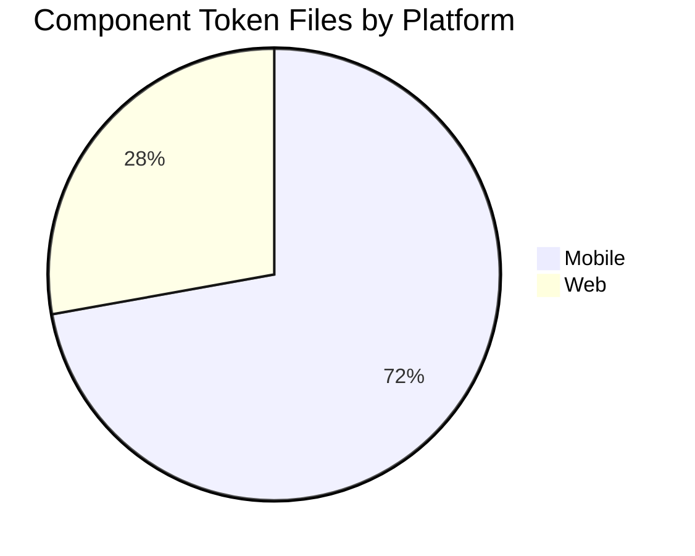
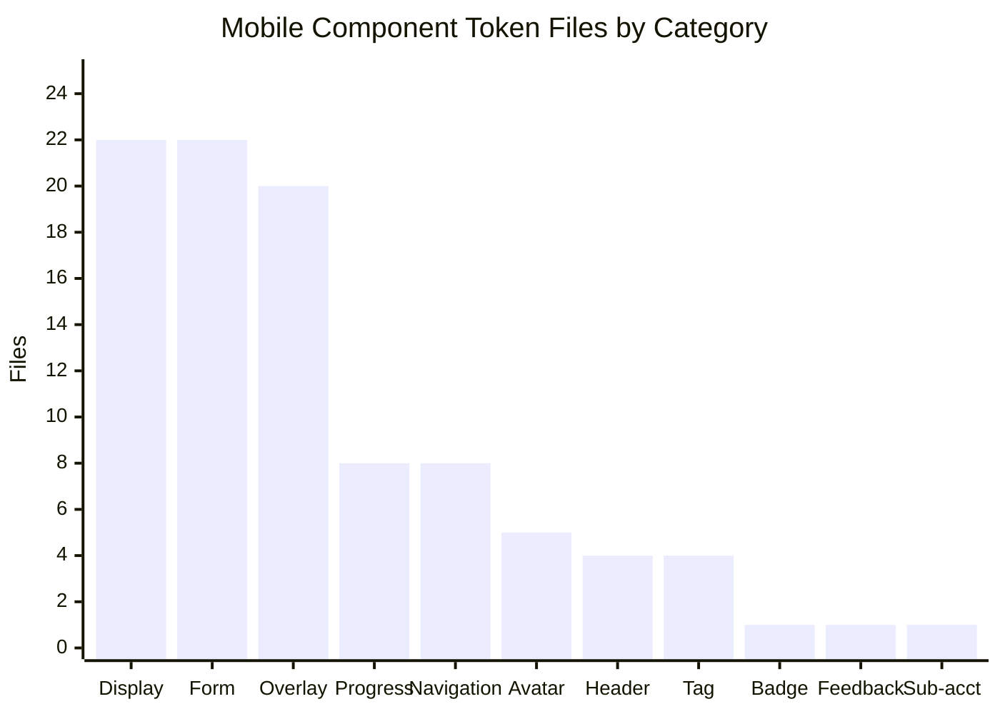
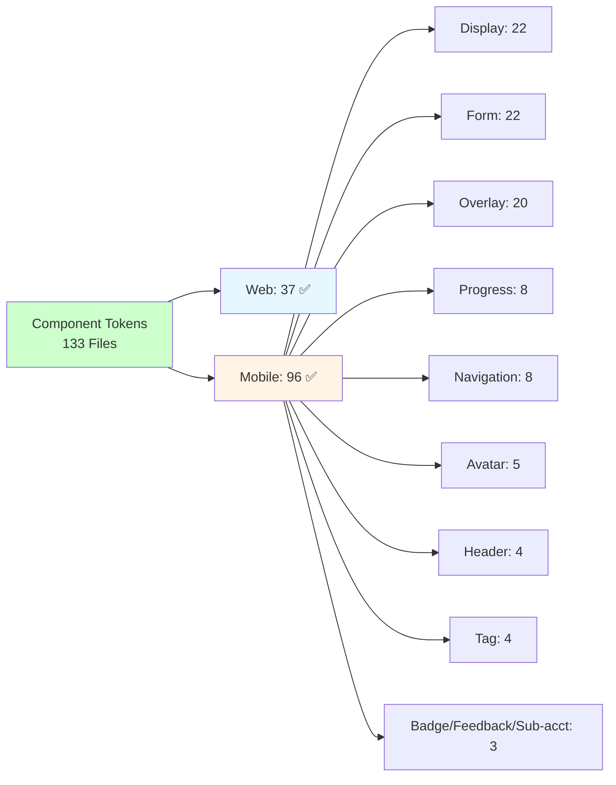

# HighRise Component Tokens - Project Status Tracker

## 📊 Project Overview
**Project**: HighRise Component Tokens Generation  
**Start Date**: Current  
**Target Completion**: 4 weeks  
**Current Phase**: Phase 3 - Extended Component Token Generation (In Progress)  

## 🎯 Current Status Summary

### ✅ Completed (Infrastructure)
- [x] Project setup and documentation
- [x] Existing token analysis (primitive + semantic foundation layers)
- [x] Component token template structure
- [x] Token generation automation scripts
- [x] File organization structure established

### ✅ Component Token Files Generated: **133 Files Complete**

**Web Components (37 files):**

**Core Interactive Components:**
- ✅ `button.json` - Primary button component
- ✅ `link-button.json` - Link-styled button  
- ✅ `action-icon.json` - Icon button
- ✅ `icon.json` - Base icon
- ✅ `toggle.json` - Toggle switch

**Form Components:**
- ✅ `input.json` - Input field
- ✅ `input-form.json` - Form input wrapper
- ✅ `textarea.json` - Textarea input
- ✅ `select.json` - Select dropdown
- ✅ `checkbox-element.json` - Checkbox
- ✅ `radio.json` - Radio button

**Avatar Components:**
- ✅ `avatar.json` - Base avatar
- ✅ `avatar-profile-photo.json` - Profile photo variant
- ✅ `avatar-company-icon.json` - Company icon variant
- ✅ `avatar-online-indicator.json` - Online indicator
- ✅ `avatar-add-button.json` - Add user button
- ✅ `avatar-with-label.json` - Avatar with name and description
- ✅ `avatar-group.json` - Avatar group component

**Tag Components:**
- ✅ `tag.json` - Base tag
- ✅ `tag-close.json` - Tag close button
- ✅ `tag-count.json` - Tag count indicator
- ✅ `tag-group.json` - Tag group component
- ✅ `badge-group.json` - Badge group component

**Navigation & Menu:**
- ✅ `tab.json` - Base tab
- ✅ `tab-item.json` - Tab item
- ✅ `dropdown-menu.json` - Dropdown container
- ✅ `dropdown-list-item.json` - Dropdown item
- ✅ `content-switcher.json` - Content switcher container
- ✅ `content-switcher-item.json` - Content switcher item
- ✅ `pagination.json` - Pagination component
- ✅ `pagination-item.json` - Pagination item
- ✅ `pagination-button-group.json` - Pagination button group

**Feedback & Overlay:**
- ✅ `alert.json` - Alert component
- ✅ `tooltip.json` - Tooltip component
- ✅ `inline-text-container.json` - Inline editor text container

**Other Components:**
- ✅ `action-group.json` - Action group component
- ✅ `time-picker.json` - Time picker component

**Template:**
- ✅ `component-token-template.json` - Standard template for new components

**Mobile Components (96 files — organized into category folders under `tokens/mobile-components/`):**

**Avatar (5):**
- ✅ `avatar.json`, `avatar-action-icon.json`, `avatar-company-indicator.json`, `avatar-mask.json`, `avatar-online-indicator.json`

**Badge (1):**
- ✅ `badge.json`

**Display (22):**
- ✅ `accordion.json`
- ✅ Carousel (6): `carousel.json`, `carousel-arrow.json`, `carousel-dot-group.json`, `carousel-dot-indicator.json`, `carousel-number-indicator.json`, `carousel-empty-container.json`
- ✅ Video player (3): `video-player.json`, `video-player-controls.json`, `video-player-media.json`
- ✅ Notification (2): `notification.json`, `notification-action.json`
- ✅ `custom-slot.json`, `drag-item.json`, `empty state.json`, `icon.json`, `list-item.json`, `message-card.json`, `no-badge.json`, `system-alert.json`, `tile.json`, `tooltip.json`

**Feedback (1):**
- ✅ `empty-state.json`

**Form (22):**
- ✅ Core: `button.json`, `checkbox.json`, `radio.json`, `select.json`, `toggle.json`, `sliding-button.json`, `timed-button.json`
- ✅ Input (4): `input.json`, `input-form.json`, `input-form-label.json`, `input-form-hint-text.json`
- ✅ Stepper (2): `input-stepper.json`, `stepper-action.json`
- ✅ Slider (4): `slider.json`, `knob.json`, `knob-container.json`, `icon-knob.json`
- ✅ OTP (3): `otp-input-mobile.json`, `otp-input-field.json`, `otp-loader.json`
- ✅ `file-upload.json`, `text-area.json`

**Header (4):**
- ✅ `header.json`, `header-lite.json`, `header-lite-left.json`, `header-action-group.json`

**Navigation (8):**
- ✅ Tabs (2): `tab.json`, `tab-item.json`
- ✅ Content switcher (2): `content-switcher.json`, `content-switcher-item.json`
- ✅ Bottom nav (2): `bottom navigation bar.json`, `menu-item-navbar.json`
- ✅ `breadcrumb-item.json`, `mobile-footer.json`

**Overlay (20):**
- ✅ Modal (3): `modal.json`, `modal-header.json`, `modal-footer.json`
- ✅ Date/time range (5): `date-range-selector.json`, `date-time-range-picker.json`, `date-picker-footer.json`, `dates.json`, `dates-gap.json`
- ✅ Time picker (3): `pin-wheel-time-picker.json`, `stepper-time-picker.json`, `time-picker-android.json`
- ✅ Mobile filter (4): `mobile-filter.json`, `mobile-filter-base.json`, `filter-item.json`, `filter-sub-item.json`
- ✅ Menu (2): `menu.json`, `menu-item.json`
- ✅ `alert.json`, `popover.json`, `snackbar.json`

**Progress (8):**
- ✅ Indicator (5): `progress-indicator.json`, `progress-bar.json`, `progress-bar-intermediate.json`, `progress-circle.json`, `progress-pill.json`
- ✅ Step (3): `progress-step.json`, `progress-step-bar.json`, `single-step.json`

**Sub-account switcher (1):**
- ✅ `sub-account-switcher.json`

**Tag (4):**
- ✅ `tag.json`, `tag-close.json`, `tag-count.json`, `tag-loader.json`

> ⚠️ **Cleanup item:** A stray nested duplicate exists at
> `tokens/mobile-components/overlay/overlay/mobile-filter/` (4 files duplicating
> `overlay/mobile-filter/`). It is excluded from the 96-file count and should be removed.


### 📊 Master Component Status

Legend: ✅ Done · 🟡 Partial (some sub-components done) · ⏳ Not Started

| Component | Status | Coverage |
|-----------|--------|----------|
| **Button** | ✅ Done | Web: button, link-button, action-icon · Mobile: button, sliding-button, timed-button |
| **Action Group** | ⏳ Not Started | — |
| **Icon** | ✅ Done | Web: icon, action-icon · Mobile: icon |
| **Tag** | ✅ Done | Web: tag, tag-close, tag-count, tag-group · Mobile: tag, tag-close, tag-count, tag-loader |
| **Badge** | 🟡 Partial | Web: badge-group · Mobile: badge, no-badge |
| **Avatar** | ✅ Done | Web: 7 variants + group · Mobile: avatar, action-icon, company-indicator, mask, online-indicator |
| **Divider** | ⏳ Not Started | — |
| **Tooltip** | ✅ Done | Web: tooltip · Mobile: tooltip |
| **Checkbox** | 🟡 Partial | Web + Mobile: checkbox (Checkbox Group / Card Group ⏳) |
| **Radio** | 🟡 Partial | Web + Mobile: radio (Radio Group / Card Group ⏳) |
| **Toggle Switch** | 🟡 Partial | Web + Mobile: toggle (Toggle Switch Group ⏳) |
| **Loader** | ⏳ Not Started | Generic loader ⏳ (otp-loader, tag-loader exist as component-specific) |
| **Input Field** | ✅ Done | Web: input, input-form · Mobile: input, input-form, input-form-label, input-form-hint-text |
| **Text Area** | ✅ Done | Web: textarea · Mobile: text-area |
| **Select** | ✅ Done | Web: select · Mobile: select |
| **Dropdown Menu** | 🟡 Partial | Web: dropdown-menu, dropdown-list-item (Expand/Collapse Item ⏳) |
| **Alert** | ✅ Done | Web: alert · Mobile: alert, system-alert |
| **Content Switcher** | ✅ Done | Web + Mobile: content-switcher, content-switcher-item |
| **Date Picker** | ✅ Done (Mobile) | Mobile: dates, dates-gap, date-range-selector, date-picker-footer |
| **Date & Time Range Picker** | ✅ Done (Mobile) | Mobile: date-time-range-picker |
| **Time Picker** | ✅ Done | Web: time-picker · Mobile: pin-wheel, stepper, android variants |
| **Input Slider** | ✅ Done (Mobile) | Mobile: slider, knob, knob-container, icon-knob |
| **File Uploader** | ✅ Done (Mobile) | Mobile: file-upload |
| **Input Stepper** | ✅ Done (Mobile) | Mobile: input-stepper, stepper-action |
| **Input OTP** | ✅ Done (Mobile) | Mobile: otp-input-mobile, otp-input-field, otp-loader |
| **Progress Indicator** | ✅ Done (Mobile) | Mobile: progress-indicator, progress-bar, progress-bar-intermediate, progress-circle, progress-pill |
| **Progress Steps** | ✅ Done (Mobile) | Mobile: progress-step, progress-step-bar, single-step |
| **Pagination** | ✅ Done (Web) | Web: pagination, pagination-item, pagination-button-group |
| **Tabs** | ✅ Done | Web + Mobile: tab, tab-item |
| **Breadcrumb** | 🟡 Partial (Mobile) | Mobile: breadcrumb-item (separator/base ⏳) |
| **Carousel** | ✅ Done (Mobile) | Mobile: carousel + arrow, dot-group, dot-indicator, number-indicator, empty-container |
| **Video Player** | ✅ Done (Mobile) | Mobile: video-player, video-player-controls, video-player-media |
| **Notification** | ✅ Done (Mobile) | Mobile: notification, notification-action |
| **Snackbar** | ✅ Done (Mobile) | Mobile: snackbar |
| **Message Card** | ✅ Done (Mobile) | Mobile: message-card |
| **Tile** | ✅ Done (Mobile) | Mobile: tile |
| **Accordion** | 🟡 Partial (Mobile) | Mobile: accordion (header/item/card-details ⏳) |
| **Menu** | ✅ Done (Mobile) | Mobile: menu, menu-item |
| **Drag** | ✅ Done (Mobile) | Mobile: drag-item |
| **Custom Slot** | ✅ Done (Mobile) | Mobile: custom-slot |
| **Empty State** | 🟡 Partial (Mobile) | Mobile: empty-state (feedback + display) (featured icon/illustration ⏳) |
| **Inline Editor** | 🟡 Partial (Web) | Web: inline-text-container (Inline Editor ⏳) |
| **Modal** | ✅ Done (Mobile) | Mobile: modal, modal-header, modal-footer |
| **Popover** | ✅ Done (Mobile) | Mobile: popover |
| **Header** | ✅ Done (Mobile) | Mobile: header, header-lite, header-lite-left, header-action-group |
| **Mobile Filter** | ✅ Done (Mobile) | Mobile: mobile-filter, mobile-filter-base, filter-item, filter-sub-item |
| **Footer** | 🟡 Partial (Mobile) | Mobile: mobile-footer (footer-actions/section-footer ⏳) |
| **Bottom Navigation Bar** | ✅ Done (Mobile) | Mobile: bottom navigation bar, menu-item-navbar |
| **Sub-account Switcher** | ✅ Done (Mobile) | Mobile: sub-account-switcher |
| **Quick Action Menu** | ⏳ Not Started | — |
| **Banner** | ⏳ Not Started | — |
| **Table / CRUD** | ⏳ Not Started | Large composite system (filters, columns, cells, conditions) |
| **Color Picker** | ⏳ Not Started | Swatches, sliders, inputs, formats |
| **Icon Emoji Media Picker** | ⏳ Not Started | Picker table, selection, modal |
| **Side Panel** | ⏳ Not Started | — |
| **Skeletal Loader** | ⏳ Not Started | — |
| **Statistic** | ⏳ Not Started | Chart, trend, statistic |
| **Code Editor** | ⏳ Not Started | — |
| **Builder Space** | ⏳ Not Started | — |
| **Primary Navigation Toolbar** | ⏳ Not Started | Chips, nav item, toolbar |
| **Mobile Navigation Bar** | 🟡 Partial | Bottom nav done (action group / nav bar shell ⏳) |

### 📈 **Status Breakdown**

- ✅ **Done**: **133 component token files** generated
  - Web components: **37 files**
  - Mobile components: **96 files**
- 🟡 **Partial**: ~10 component groups have base/key sub-components but not full coverage
  (Badge, Checkbox/Radio/Toggle groups, Dropdown, Breadcrumb, Accordion, Empty State, Inline Editor, Footer, Mobile Nav Bar)
- ⏳ **Not Started**: Large composite systems and specialized pickers
  (Table/CRUD, Color Picker, Media Picker, Side Panel, Statistic, Code Editor, Builder Space, Banner, Divider, Loader, Quick Action Menu, Primary Navigation Toolbar)

#### Mobile files by category
| Category | Files |
|----------|-------|
| Avatar | 5 |
| Badge | 1 |
| Display | 22 |
| Feedback | 1 |
| Form | 22 |
| Header | 4 |
| Navigation | 8 |
| Overlay | 20 |
| Progress | 8 |
| Sub-account switcher | 1 |
| Tag | 4 |
| **Total** | **96** |

#### **Quick ASCII Progress Bar:**
```
Component Token Files Completed: 133  (37 web + 96 mobile)
Coverage of identified component set (~190 leaf components):
✅ Done:        ███████████████████████████████░░░░░░░░░░░░░  (133)  [~70%]
🟡/⏳ Remaining: ████████████░░░░░░░░░░░░░░░░░░░░░░░░░░░░░░░░░  (~57)  [~30%]

Milestone: Mobile component library now the largest surface — 96 files across 11 categories.
```

### 📊 **Project Progress Charts**

#### **Status Distribution Overview**


#### **Mobile Coverage by Category**


#### **Token Files Overview**


## 📈 Progress Metrics

### Token Generation Progress
- **Primitive Tokens**: foundation layer complete (~3.9k-line source) ✅
- **Semantic Tokens**: foundation layer complete (~5.4k-line source incl. semantic color scales) ✅
- **Component Token Files**: **133 files** ✅
  - Web components: 37 files
  - Mobile components: 96 files

### Achievement Milestones
- **Phase 1 — Infrastructure**: 100% complete ✅
- **Phase 2 — Core Components**: complete ✅ (all critical/high/medium priority web + mobile core)
- **Phase 3 — Extended Components**: in progress 🟡
  - Mobile library expanded from 34 → 96 files
  - New families: carousel, video player, slider, OTP, progress (indicator + step), date/time range picker, menu, file upload, accordion, breadcrumb, snackbar, notification, tile, mobile filter, sub-account switcher
- **Tooling**: 4 Figma plugins + token visualizer + figma-mappings pipeline ✅

## 🎉 Major Achievements
1. **133 component token files** across web (37) and mobile (96)
2. **Mobile library** is now the largest surface, organized into 11 category folders
3. **Complex components** now covered on mobile: date/time range pickers, sliders, OTP, progress, carousel, video player, menu
4. **Tooling ecosystem**: token-sync, apply-tokens, import-tokens, and semantic-colors Figma plugins plus a Next.js token visualizer
5. **Theme + platform separation** maintained throughout (light/dark; web vs mobile)

## 🚀 Next Actions

### Immediate Priorities
1. **Remove the duplicate** `overlay/overlay/mobile-filter/` folder (4 stray files)
2. **Close partial groups**: Checkbox/Radio/Toggle groups, Accordion (header/item), Breadcrumb (base/separator), Footer, Dropdown (expand/collapse)
3. **Port high-traffic mobile components to web** where web is still missing (modal, header, progress, slider, date picker)

### Future Phase Planning
1. **Large composite systems**: Table / CRUD, Color Picker, Icon/Emoji/Media Picker
2. **Layout & utility**: Side Panel, Statistic, Code Editor, Builder Space, Banner, Divider, Skeletal Loader
3. **Documentation**: usage guides + migration guides for implementation teams

## 📊 Success Criteria
- [x] **Phase 1**: Core infrastructure complete ✅
- [x] **Phase 2**: Essential web + mobile core component token files complete ✅
- [ ] **Phase 3**: Extended components (in progress — composite systems remaining)
- [ ] **Phase 4**: Comprehensive documentation and usage guides
- [ ] **Phase 5**: Migration guides for implementation teams

## 📝 Decision Log

### Confirmed Decisions
- **File Organization**: ✅ Separate JSON per component; platform separation (`web-components/`, `mobile-components/`)
- **Mobile sub-foldering**: ✅ Mobile components grouped into category folders (avatar, display, form, overlay, progress, …)
- **Theme Handling**: ✅ Nested light/dark in same file
- **Semantic Token Rule**: ✅ 3+ usage creates a semantic token
- **Responsive Breakpoints**: ✅ Mobile / Tablet / Large defined
- **Tooling**: ✅ Figma plugins + token-visualizer + figma-mappings pipeline adopted for code↔design sync

### Implementation Patterns Established
- **Shared/Variants Structure**: consistent across components
- **State Management**: default, hover, active, focused, disabled
- **Typography Integration**: separate typography sections
- **Icon Token Organization**: size and color separation
- **Focus Ring Integration**: semantic token references

## 🎯 **PROJECT STATUS: PHASE 3 IN PROGRESS**

**Current Deliverables:**
- ✅ Primitive + Semantic foundation layers
- ✅ **133 Component Token Files** (37 web + 96 mobile)
- ✅ Automated generation scripts
- ✅ Figma plugin toolchain (sync / apply / import / semantic-colors)
- ✅ Token visualizer (Next.js)
- ✅ Platform separation (web / mobile)

---

**Last Updated**: Jun 23, 2026  
**Next Review**: Phase 3 Progress Check  
**Document Owner**: Project Team  
**Status**: ✅ **133 FILES COMPLETE (37 web + 96 mobile) — PHASE 3 IN PROGRESS** ✅
