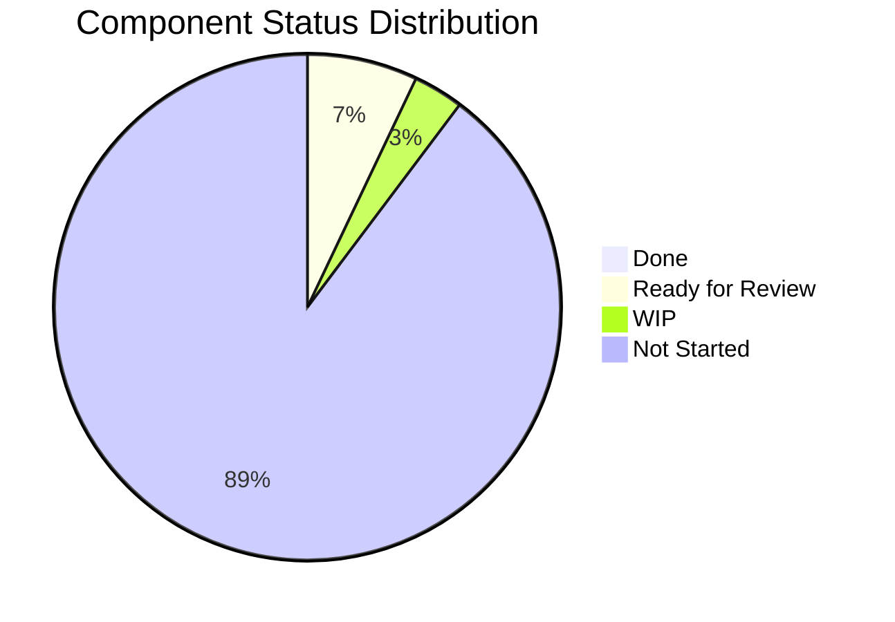
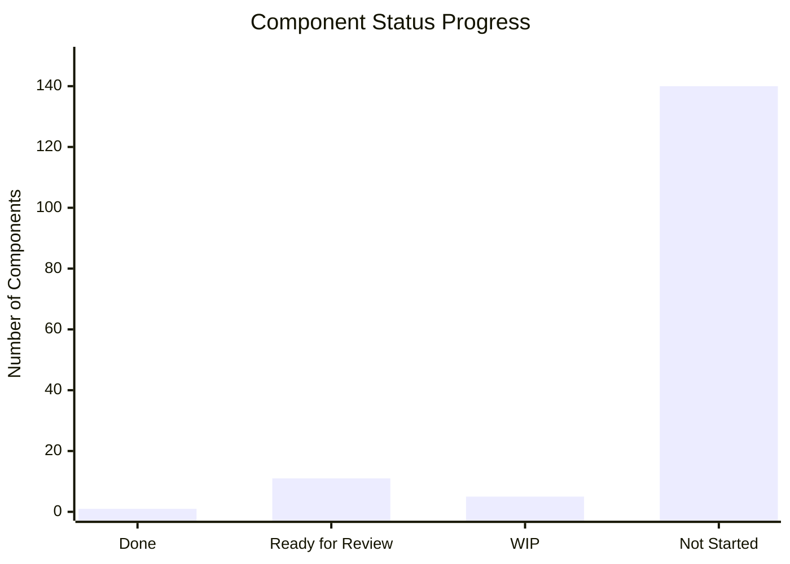
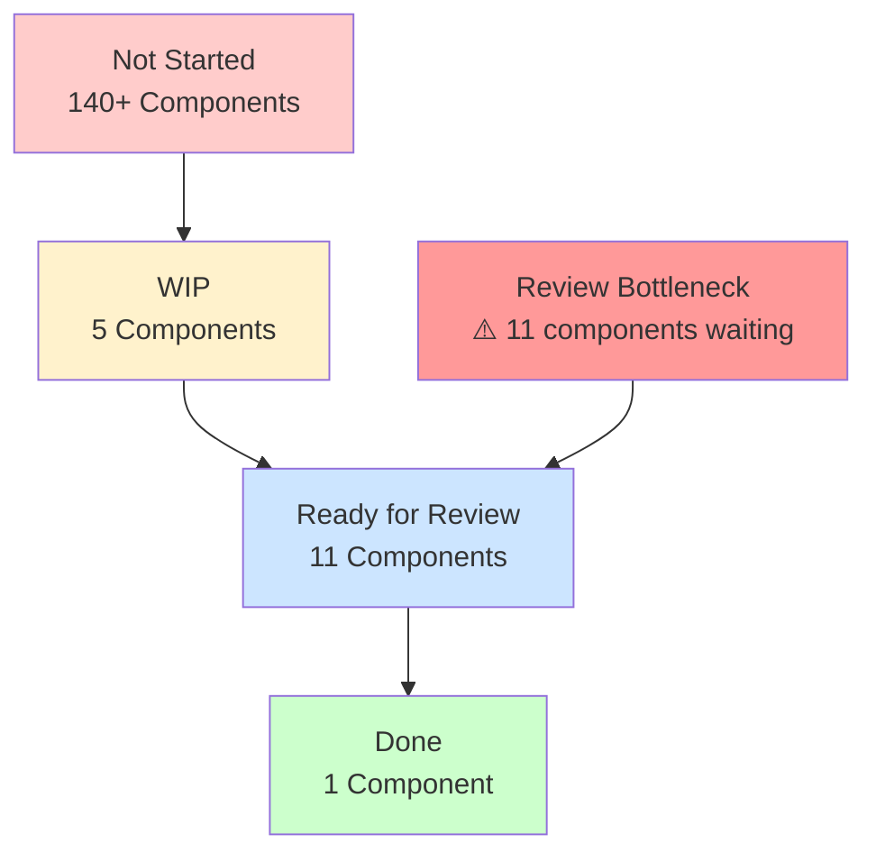

# HighRise Component Tokens - Project Status Tracker

## 📊 Project Overview
**Project**: HighRise Component Tokens Generation  
**Start Date**: Current  
**Target Completion**: 4 weeks  
**Current Phase**: Phase 2 - Component Token Generation (In Progress)  

## 🎯 Current Status Summary

### ✅ Completed (Infrastructure)
- [x] Project setup and documentation
- [x] Existing token analysis (3,140 primitive + 4,508 semantic tokens)
- [x] Component token template structure
- [x] Token generation automation scripts
- [x] File organization structure established

### 📊 Component Status Summary

| Component | Sub/Base Components | Status |
|-----------|-------------------|---------|
| **Button** | Button | ✅ **Done** |
| | Action Group | ⏳ **Not Started** |
| | | |
| **Tag** | Tag x close | 🔄 **Ready for Review** |
| | Tag count | 🔄 **Ready for Review** |
| | Tag | 🔄 **Ready for Review** |
| | Badge group | ⏳ **Not Started** |
| | Tag Group | ⏳ **Not Started** |
| | | |
| **Avatar** | Avatar add button | ⏳ **Not Started** |
| | Avatar profile photo | ⏳ **Not Started** |
| | Avatar online indicator | 🔄 **Ready for Review** |
| | Avatar company icon | 🔄 **Ready for Review** |
| | Avatar | 🔄 **Ready for Review** |
| | Avatar colors | ⏳ **Not Started** |
| | | |
| **Divider** | Divider | ⏳ **Not Started** |
| | | |
| **Tooltip** | Tooltip | 🔄 **Ready for Review** |
| | | |
| **Checkbox** | Checkbox | 🔄 **Ready for Review** |
| | Checkbox | ⏳ **Not Started** |
| | | |
| **Radio** | Radio | 🔄 **Ready for Review** |
| | Radio | ⏳ **Not Started** |
| | | |
| **Toggle Switch** | Toggle base | ⏳ **Not Started** |
| | Toggle Switch | ⏳ **Not Started** |
| | | |
| **Loader** | Loader | ⏳ **Not Started** |
| | | |
| **Input Field** | Input Field | 🔄 **Ready for Review** |
| | | |
| **Text Area** | Textarea input field | 🚧 **WIP** |
| | | |
| **Select** | Select | 🚧 **WIP** |
| | | |
| **Dropdown Menu** | Expand Collapse Item | ⏳ **Not Started** |
| | Dropdown List Item | 🚧 **WIP** |
| | Dropdown | 🚧 **WIP** |
| | | |
| **Avatar Group** | Avatar group | ⏳ **Not Started** |
| | Avatar with Label | ⏳ **Not Started** |
| | | |
| **Alert** | Alert | 🔄 **Ready for Review** |
| | | |
| **Content Switcher** | Content Switcher Item | ⏳ **Not Started** |
| | Content Switcher | ⏳ **Not Started** |
| | | |
| **Checkbox Group** | Checkbox Group | ⏳ **Not Started** |
| | | |
| **Checkbox Card Group** | Checkbox Card | ⏳ **Not Started** |
| | Checkbox Card Group | ⏳ **Not Started** |
| | | |
| **Radio Group** | Radio Group | ⏳ **Not Started** |
| | | |
| **Radio Card Group** | Radio Card | ⏳ **Not Started** |
| | Radio Card Group | ⏳ **Not Started** |
| | | |
| **Date Picker** | Dates | ⏳ **Not Started** |
| | Gap | ⏳ **Not Started** |
| | Picker Menu | ⏳ **Not Started** |
| | | |
| **Input Slider** | Control handle | ⏳ **Not Started** |
| | Slider | ⏳ **Not Started** |
| | Input Slider | ⏳ **Not Started** |
| | | |
| **Toggle Switch Group** | Toggle Switch Group | ⏳ **Not Started** |
| | | |
| **File Uploader** | File Upload Icon | ⏳ **Not Started** |
| | File upload base | ⏳ **Not Started** |
| | Files | ⏳ **Not Started** |
| | File Uploader | ⏳ **Not Started** |
| | | |
| **Progress Indicator** | Progress bar | ⏳ **Not Started** |
| | Indeterminate | ⏳ **Not Started** |
| | Progress Indicator | ⏳ **Not Started** |
| | Progress circle | ⏳ **Not Started** |
| | | |
| **Progress Steps** | Step | ⏳ **Not Started** |
| | Progress Content | ⏳ **Not Started** |
| | Progress Step | ⏳ **Not Started** |
| | Progress Steps | ⏳ **Not Started** |
| | | |
| **Input OTP** | OTP Input Field | ⏳ **Not Started** |
| | OTP Input | ⏳ **Not Started** |
| | | |
| **Date & Time Range Picker** | Date Time Range Picker | ⏳ **Not Started** |
| | Date Time Range Picker | ⏳ **Not Started** |
| | | |
| **Time Picker** | Time Picker | ⏳ **Not Started** |
| | Time Picker Menu | ⏳ **Not Started** |
| | | |
| **Inline Editor** | Inline Text Container | ⏳ **Not Started** |
| | Inline Editor | ⏳ **Not Started** |
| | | |
| **Quick Action Menu** | Quick Actions Menu Item | ⏳ **Not Started** |
| | Quick Menu Action Icons | ⏳ **Not Started** |
| | Quick Action Menu | ⏳ **Not Started** |
| | | |
| **Pagination** | Pagination button group base | ⏳ **Not Started** |
| | Pagination Item | ⏳ **Not Started** |
| | Pagination | ⏳ **Not Started** |
| | | |
| **Tabs** | Tab Item | 🚧 **WIP** |
| | Tabs | ⏳ **Not Started** |
| | No. badge | ⏳ **Not Started** |
| | | |
| **Breadcrumb** | Breadcrumb Separator | ⏳ **Not Started** |
| | Breadcrumb button base | ⏳ **Not Started** |
| | Breadcrumb | ⏳ **Not Started** |
| | | |
| **Empty State** | Featured icon | ⏳ **Not Started** |
| | Illustration | ⏳ **Not Started** |
| | Empty State | ⏳ **Not Started** |
| | | |
| **CRUD** | Search, Filter | ⏳ **Not Started** |
| | Bulk Actions | ⏳ **Not Started** |
| | Action | ⏳ **Not Started** |
| | CRUD | ⏳ **Not Started** |
| | Layout Manager | ⏳ **Not Started** |
| | Layout Manager Expanded | ⏳ **Not Started** |
| | | |
| **Footer** | Footer Actions | ⏳ **Not Started** |
| | Section Footer | ⏳ **Not Started** |
| | | |
| **Header Lite** | Header Lite | ⏳ **Not Started** |
| | Header Lite Left | ⏳ **Not Started** |
| | Header Lite Right | ⏳ **Not Started** |
| | | |
| **Header** | Header | ⏳ **Not Started** |
| | Search | ⏳ **Not Started** |
| | Header Image | ⏳ **Not Started** |
| | Search/Phone Header | ⏳ **Not Started** |
| | Search/Notification Header | ⏳ **Not Started** |
| | | |
| **Modal** | Modal | ⏳ **Not Started** |
| | | |
| **Primary Navigation Toolbar** | Chips | ⏳ **Not Started** |
| | Primary Navigation Item | ⏳ **Not Started** |
| | Primary Navigation Toolbar | ⏳ **Not Started** |
| | | |
| **Color Picker** | Color Swatch | ⏳ **Not Started** |
| | Swatch Tile | ⏳ **Not Started** |
| | Color Picker Menu | ⏳ **Not Started** |
| | Color Swatch with Label | ⏳ **Not Started** |
| | Color Selector | ⏳ **Not Started** |
| | Color Picker Slider | ⏳ **Not Started** |
| | Color Input | ⏳ **Not Started** |
| | Color Code | ⏳ **Not Started** |
| | Color Format | ⏳ **Not Started** |
| | All Colors | ⏳ **Not Started** |
| | | |
| **Input Form** | Input Form | 🚧 **WIP** |
| | | |
| **Table** | Value Selection | ⏳ **Not Started** |
| | Advanced Conditions | ⏳ **Not Started** |
| | Multi Condition | ⏳ **Not Started** |
| | Nested Condition | ⏳ **Not Started** |
| | Switch | ⏳ **Not Started** |
| | Condition Switcher | ⏳ **Not Started** |
| | Operator | ⏳ **Not Started** |
| | Filter Item | ⏳ **Not Started** |
| | Advanced Filters | ⏳ **Not Started** |
| | Conditions | ⏳ **Not Started** |
| | Select Conditions | ⏳ **Not Started** |
| | Sort & Filter Menu | ⏳ **Not Started** |
| | User Driven | ⏳ **Not Started** |
| | Table with Header | ⏳ **Not Started** |
| | Table | ⏳ **Not Started** |
| | Manage Columns Panel | ⏳ **Not Started** |
| | Manage Columns | ⏳ **Not Started** |
| | Column Name | ⏳ **Not Started** |
| | Column Organiser Header | ⏳ **Not Started** |
| | Column Configurator | ⏳ **Not Started** |
| | Table Content | ⏳ **Not Started** |
| | Row Content | ⏳ **Not Started** |
| | Column | ⏳ **Not Started** |
| | Column Content | ⏳ **Not Started** |
| | Cell | ⏳ **Not Started** |
| | | |
| **Accordion** | Card Details | ⏳ **Not Started** |
| | Accordion | ⏳ **Not Started** |
| | Accordion Header | ⏳ **Not Started** |
| | Accordion Item | ⏳ **Not Started** |
| | | |
| **Switch Sub-account Menu** | Sub-account Menu | ⏳ **Not Started** |
| | | |
| **Bottom Navigation Bar** | Bottom Navigation Bar Item | ⏳ **Not Started** |
| | Bottom Navigation Bar | ⏳ **Not Started** |
| | | |
| **Mobile Navigation Bar** | Action group | ⏳ **Not Started** |
| | Mobile Navigation Bar | ⏳ **Not Started** |
| | | |
| **Skeletal Loader** | Skeleton Loader | ⏳ **Not Started** |
| | | |
| **Banner** | Banner | ⏳ **Not Started** |
| | | |
| **Carousel** | Carousel dot indicator | ⏳ **Not Started** |
| | Carousel arrow | ⏳ **Not Started** |
| | Carousel dot group | ⏳ **Not Started** |
| | Carousel | ⏳ **Not Started** |
| | | |
| **Code Editor** | Code Editor | ⏳ **Not Started** |
| | | |
| **Side Panel** | Side Panel | ⏳ **Not Started** |
| | | |
| **Menu** | Menu | ⏳ **Not Started** |
| | Level 1 | ⏳ **Not Started** |
| | Level 2 | ⏳ **Not Started** |
| | Menu Items | ⏳ **Not Started** |
| | Multi Level Menu Item | ⏳ **Not Started** |
| | | |
| **Drag** | Drag | ⏳ **Not Started** |
| | | |
| **Builder Space** | Builder Space Value | ⏳ **Not Started** |
| | Builder Space | ⏳ **Not Started** |
| | Builder Space Picker | ⏳ **Not Started** |
| | | |
| **Icon Emoji Media Picker** | PickerTable | ⏳ **Not Started** |
| | Picker Selection | ⏳ **Not Started** |
| | IconPicker Modal | ⏳ **Not Started** |
| | Add Icon | ⏳ **Not Started** |
| | Icon Emoji GIF Picker | ⏳ **Not Started** |
| | Icon Emoji GIF Picker Swatch with Label | ⏳ **Not Started** |
| | Icon Emoji GIF Picker Swatch | ⏳ **Not Started** |
| | | |
| **Statistic** | Chart | ⏳ **Not Started** |
| | Trend | ⏳ **Not Started** |
| | Statistic | ⏳ **Not Started** |
| | | |
| **Tile** | Tile | ⏳ **Not Started** |
| | | |
| **Icon** | Icon | 🔄 **Ready for Review** |
| | Action Icon | 🔄 **Ready for Review** |

### 📈 **Status Breakdown:**
- ✅ **Done**: 1 component (Button)
- 🔄 **Ready for Review**: 11 components  
- 🚧 **WIP**: 5 components
- ⏳ **Not Started**: 140+ sub-components across 40+ main components

### 📊 **Project Progress Charts**

#### **Status Distribution Overview**

#### **Progress Bar Chart**

#### **Workflow & Bottlenecks**

## 🎯 Component Priority Status

### ✅ Critical Priority (Week 1-2)
| Component | Status | Progress | Notes |
|-----------|---------|----------|-------|
| Button | ✅ **DONE** | 100% | Complete implementation |
| Icon | 🔄 **READY FOR REVIEW** | 95% | Awaiting final review |
| Input Field | 🔄 **READY FOR REVIEW** | 95% | Awaiting final review |
| Avatar | 🔄 **READY FOR REVIEW** | 95% | All variants completed |

### 🚧 High Priority (Week 2-3)
| Component | Status | Progress | Dependencies |
|-----------|---------|----------|--------------|
| Select | 🚧 **WIP** | 70% | Input patterns |
| Alert | 🔄 **READY FOR REVIEW** | 95% | Core components |
| Dropdown | 🚧 **WIP** | 60% | Menu + List Items |
| Form Components | 🔄 **READY FOR REVIEW** | 80% | Radio, Checkbox ready |

### ⏳ Medium Priority (Week 3-4)
| Component | Status | Progress | Dependencies |
|-----------|---------|----------|--------------|
| Tabs | 🚧 **WIP** | 50% | Navigation patterns |
| Tooltip | 🔄 **READY FOR REVIEW** | 95% | Utility patterns |
| Tag System | 🔄 **READY FOR REVIEW** | 95% | All variants |
| Textarea | 🚧 **WIP** | 60% | Input patterns |

## 📈 Progress Metrics

### Token Generation Progress
- **Primitive Tokens**: 3,140 (Complete) ✅
- **Semantic Tokens**: 4,508 (Complete) ✅
- **Component Tokens**: **17/50+ (34% COMPLETE)**
  - Done: 1 component
  - Ready for Review: 11 components
  - Work in Progress: 5 components
  - Not Started: 30+ components

### Weekly Progress Targets
- **Week 1**: Infrastructure (100% complete) ✅
- **Week 2**: 5 core components → **Current: 1 done, 11 in review**
- **Week 3**: Target 15 total components
- **Week 4**: Target 25+ total components

## 🚨 Current Blockers & Challenges

### 🔴 Active Blockers
1. **Review Process**: 11 components waiting for review and approval
2. **Resource Allocation**: Need more development time for WIP components
3. **Component Complexity**: Large systems (Table, CRUD) require extensive planning

### 🟡 Risks
- **Timeline Pressure**: Only 1 component fully complete vs. target
- **Review Bottleneck**: Large queue of components awaiting review
- **Scope Creep**: 50+ components identified vs. original 22 estimate

## 📋 Next Actions (Immediate)

### This Week Priority
1. **Complete Review Process**: Finalize 11 components in "Ready for Review"
2. **Finish WIP Components**: Complete 5 components currently in progress
3. **Resource Planning**: Assess timeline for remaining 30+ components
4. **Priority Re-evaluation**: Focus on most critical components first

### Next Week Priority
1. **Start Critical Missing Components**: Toggle Switch, Loader, Divider
2. **Complex System Planning**: Begin Table and CRUD component analysis
3. **Pattern Documentation**: Document established patterns for consistency

## 📊 Success Criteria - **UPDATED TARGETS**
- [ ] **Phase 1**: 15 core components complete (Currently: 1 done, 11 in review)
- [ ] **Phase 2**: 25 essential components complete
- [ ] **Phase 3**: All critical components complete
- [ ] Documentation and usage guides complete
- [ ] Migration guides available for implementation teams

## 📝 Decision Log

### Confirmed Decisions
- **File Organization**: ✅ Separate JSON files per component (Implemented)
- **Theme Handling**: ✅ Nested light/dark in same file (Implemented)
- **Semantic Token Rule**: ✅ 3+ usage creates semantic token (Applied)
- **Responsive Breakpoints**: ✅ Mobile/Tablet/Large defined (Implemented)

### Implementation Patterns Established
- **Shared/Variants Structure**: Consistent across all components
- **State Management**: Default, hover, active, focused, disabled states
- **Typography Integration**: Separate typography sections for consistency
- **Icon Token Organization**: Size and color separation pattern
- **Focus Ring Integration**: Proper semantic token references

## 🎯 **PROJECT STATUS: IN PROGRESS**

**Current Deliverables:**
- ✅ 3,140 Primitive Tokens
- ✅ 4,508 Semantic Tokens  
- 🚧 17 Component Token Files (1 complete, 11 in review, 5 WIP)
- ✅ Automated Generation Scripts
- ✅ Comprehensive Token Structure

**Reality Check:**
- **Scope**: 50+ components identified (vs. original 22 estimate)
- **Timeline**: Significant work remaining
- **Quality**: Strong foundation with consistent patterns
- **Process**: Review bottleneck needs addressing

---

**Last Updated**: December 2024  
**Next Review**: Weekly Progress Review  
**Document Owner**: Project Team  
**Status**: 🚧 **ACTIVE DEVELOPMENT** 🚧 