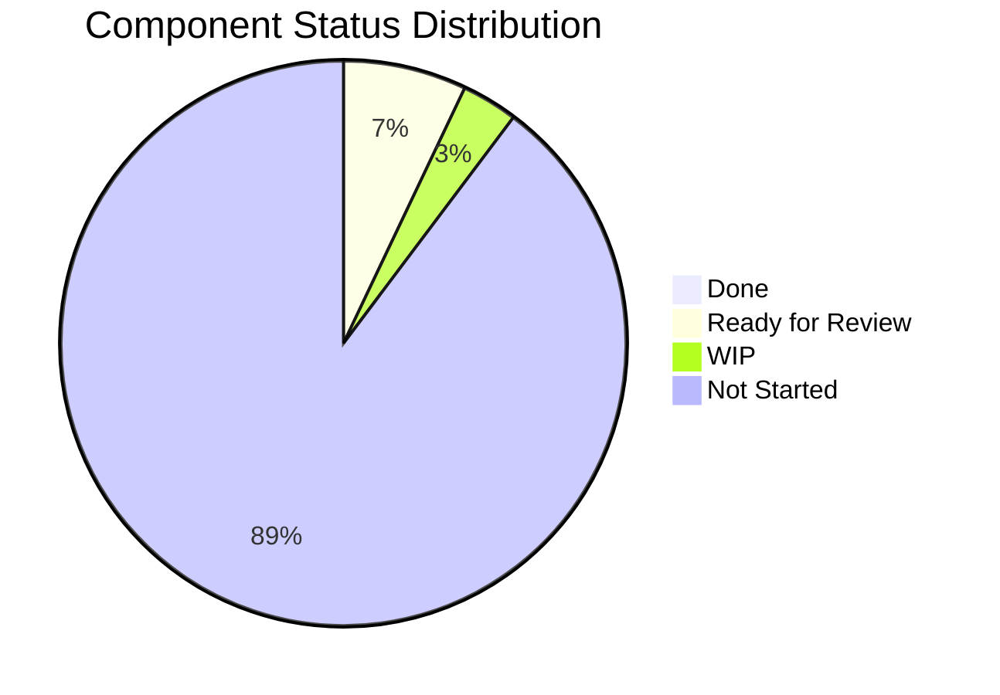
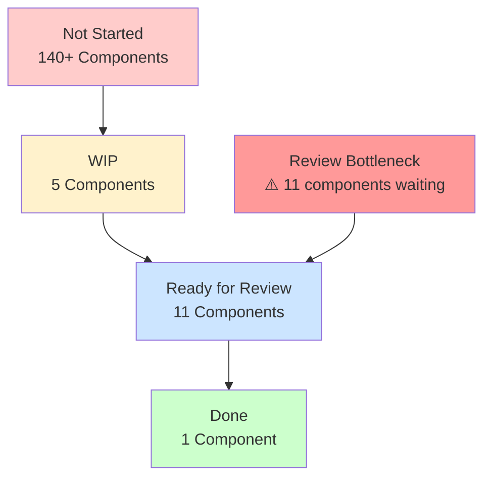

# HighRise Component Tokens

> **Systematic design token generation for the HighRise Design System**

[](https://highrise.gohighlevel.com/)
[](https://design-tokens.github.io/community-group/format/)
[](LICENSE)

## 🎯 Project Overview

The HighRise Component Tokens project generates comprehensive, component-specific design tokens for all components in the [HighRise Design System](https://highrise.gohighlevel.com/). This systematic approach ensures consistent visual design across all GHL ecosystem applications while maintaining scalability and maintainability.

### Key Features

- **🎨 Component-Specific Tokens**: Individual token files for each HighRise component
- **📱 Responsive Design**: Mobile, tablet, and large screen variants
- **🌗 Theme Support**: Light and dark theme tokens nested within same structure
- **🔄 Semantic Hierarchy**: Prioritizes semantic values over primitive tokens
- **🤖 Automated Generation**: Scripts to analyze patterns and generate tokens
- **📊 Usage Analysis**: Identifies common patterns for semantic token creation

## 📋 Token Hierarchy

The project follows a hierarchical token structure with three main levels:

### 1. Primitive Tokens
**Structure**: `Category` → `Sub-category` → `Concept` → `Property` → `Variant` → `Scale`

```json
{
  "color": {
    "primary": {
      "blue": {
        "500": {
          "value": "#1c6dff",
          "type": "color"
        }
      }
    }
  }
}
```

### 2. Semantic Tokens
**Structure**: `Category` → `Sub-Category` → `Concept` → `Property` → `Variant` → `State` → `Scale`

```json
{
  "color": {
    "background": {
      "surface": {
        "primary": {
          "default": {
            "value": "{color.primary.blue.500}",
            "type": "color"
          }
        }
      }
    }
  }
}
```

### 3. Component-Specific Tokens
**Structure**: `Component` → `Element` → `Category` → `Sub-Category` → `Concept` → `Property` → `Variant` → `State` → `Scale`

```json
{
  "button": {
    "primary": {
      "background": {
        "color": {
          "default": {
            "hover": {
              "value": "{color.background.surface.primary.hover}",
              "type": "color"
            }
          }
        }
      }
    }
  }
}
```

### 4. Responsive Tokens
**Structure**: `Component` → `Element` → `Category` → `Sub-Category` → `Concept` → `Property` → `Variant` → `State` → `Breakpoint`

```json
{
  "button": {
    "primary": {
      "size": {
        "padding": {
          "horizontal": {
            "default": {
              "mobile": {
                "value": "{size.spacing.padding.sm}",
                "type": "dimension"
              }
            }
          }
        }
      }
    }
  }
}
```

## 🏗️ Project Structure

```
HighRise-Tokens/
├── README.md                          # This file
├── HighRise-Component-Tokens-Project.md  # Project tracking document
├── tokens/
│   ├── primitive/
│   │   └── Default.json              # Base primitive tokens (3,140 lines)
│   ├── Semantic.json                 # Semantic layer tokens (4,508 lines)
│   ├── components/                   # Component-specific tokens
│   │   ├── component-token-template.json
│   │   ├── icon.json                 # Generated component tokens
│   │   ├── button.json
│   │   ├── input.json
│   │   └── ...
│   ├── generated-highrise-scales/    # Generated color scales
│   │   ├── light.json
│   │   ├── dark.json
│   │   └── ...
│   └── Component Specific/           # Legacy component tokens
│       └── Mode 1.json              # Existing tag component
├── scripts/
│   └── token-generator.py           # Token generation automation
└── remove_tokens_wrapper.py         # Utility script
```

## 🚀 Getting Started

### Prerequisites

- Python 3.6 or higher
- Access to HighRise Design System Figma files

### Installation

1. Clone this repository
2. Ensure Python dependencies are available (json, os, argparse, collections)
3. Review the project tracking document for current status

### Usage

#### Analyze Token Usage Patterns

```bash
python3 scripts/token-generator.py --analyze
```

This will show:
- Total unique tokens referenced
- Top 10 most used tokens
- Semantic token candidates (3+ usage)

#### Generate Component Tokens

```bash
python3 scripts/token-generator.py --component ButtonComponent
```

This creates a new component token file with:
- Light/dark theme variants
- Responsive breakpoint tokens
- All standard states and variants

#### Custom Component Configuration

Create a JSON config file:

```json
{
  "elements": ["container", "icon", "label"],
  "properties": ["background", "color", "border", "padding"],
  "variants": ["primary", "secondary", "tertiary"],
  "states": ["default", "hover", "active", "focused", "disabled"]
}
```

Then generate:

```bash
python3 scripts/token-generator.py --component MyComponent --config my-config.json
```

## 🎨 Component Processing Workflow

### For Each Component:

1. **📋 Figma Analysis**
   - Extract all visual properties (colors, sizes, spacing, etc.)
   - Identify different states (default, hover, active, focused, disabled)
   - Document variants and element hierarchy

2. **🔧 Token Generation**
   - Follow naming convention structure
   - Prioritize semantic token references
   - Create fallback to primitive tokens when semantic unavailable

3. **🔍 Pattern Identification**
   - Look for repeated patterns across components
   - Create new semantic tokens for common design decisions
   - Update semantic token library

4. **💾 File Creation**
   - Generate JSON file following established structure
   - Include all states, variants, and responsive breakpoints
   - Add comprehensive documentation

## 📱 Responsive Breakpoints

The system uses three responsive breakpoints:

- **Mobile**: 320px - 767px
- **Tablet**: 768px - 1024px  
- **Large**: 1025px+

Responsive tokens are generated for properties that need scaling across different screen sizes, primarily:
- Padding and margins
- Font sizes and line heights
- Component dimensions

## 🎯 Component Priority Order

Components are processed in the following priority order:

### Phase 1 - Core Components
1. **Icon** - Base visual element
2. **Button** - Primary interactive component
3. **Input Field** - Form component
4. **Select** - Form component
5. **Avatar** - Display component
6. **Tag** - Already implemented

### Phase 2 - Extended Components
7. Card, Modal, Dropdown, Alert/Banner

### Phase 3 - Layout & Navigation
11. Navigation, Tabs, Sidebar, Header, Breadcrumb

### Phase 4 - Data & Utility
16. Table, Form, Tooltip, Badge, Progress Bar, Pagination, Footer

## 🔄 Semantic Token Strategy

The project uses a **3+ usage rule** for creating semantic tokens:

- **Automatic Detection**: Tokens used in 3+ components become semantic token candidates
- **Pattern Recognition**: Common design patterns are identified and abstracted
- **Utility Creation**: Frequently used patterns (focus rings, shadows) become utility tokens

## 🤝 Contributing

### Adding New Components

1. Share the Figma design link for the component
2. The token generator will analyze the design and extract properties
3. Component tokens will be generated following the established structure
4. New semantic tokens will be created for any 3+ usage patterns

### Updating Existing Components

1. Modify the component's JSON file in `tokens/components/`
2. Run the analyzer to check for new semantic token opportunities
3. Update the project tracking document with changes

## 📊 Project Status & Progress

### 🎯 Current Phase: **Component Token Generation (In Progress)**

### ✅ Completed Infrastructure
- [x] Project setup and documentation
- [x] Existing token analysis (3,140 primitive + 4,508 semantic tokens)
- [x] Component token template structure
- [x] Token generation automation scripts
- [x] File organization structure established

### 📈 **Component Status Summary**

#### **Quick Progress Overview:**
```
Progress Overview (157 Total Components):
✅ Done:           ▌ (1)   [  0.6%]
🔄 Ready for Review: ████████████▌ (11)  [  7.0%]
🚧 WIP:            ██▌ (5)   [  3.2%]
⏳ Not Started:    ████████████████████████████████████████████████████████████████████████████████████████████████████ (140) [ 89.2%]

Critical Action Needed: 11 components await review approval!
```

#### **Status Breakdown:**
- ✅ **Done**: 1 component (Button)
- 🔄 **Ready for Review**: 11 components  
- 🚧 **WIP**: 5 components
- ⏳ **Not Started**: 140+ sub-components across 40+ main components

### 📊 **Interactive Charts**

#### **Status Distribution**


#### **Progress Workflow**


### 🎯 **Priority Component Status**

| Priority | Component | Status | Progress | Notes |
|----------|-----------|---------|----------|-------|
| **Critical** | Button | ✅ **DONE** | 100% | Complete implementation |
| **Critical** | Icon | 🔄 **READY FOR REVIEW** | 95% | Awaiting final review |
| **Critical** | Input Field | 🔄 **READY FOR REVIEW** | 95% | Awaiting final review |
| **Critical** | Avatar | 🔄 **READY FOR REVIEW** | 95% | All variants completed |
| **High** | Select | 🚧 **WIP** | 70% | Input patterns |
| **High** | Alert | 🔄 **READY FOR REVIEW** | 95% | Core components |
| **High** | Dropdown | 🚧 **WIP** | 60% | Menu + List Items |
| **Medium** | Tabs | 🚧 **WIP** | 50% | Navigation patterns |
| **Medium** | Tooltip | 🔄 **READY FOR REVIEW** | 95% | Utility patterns |
| **Medium** | Tag System | 🔄 **READY FOR REVIEW** | 95% | All variants |
| **Medium** | Textarea | 🚧 **WIP** | 60% | Input patterns |

### 🚨 **Current Blockers & Next Actions**

#### **🔴 Active Blockers**
1. **Review Process**: 11 components waiting for review and approval
2. **Resource Allocation**: Need more development time for WIP components
3. **Component Complexity**: Large systems (Table, CRUD) require extensive planning

#### **📋 This Week Priority**
1. **Complete Review Process**: Finalize 11 components in "Ready for Review"
2. **Finish WIP Components**: Complete 5 components currently in progress
3. **Resource Planning**: Assess timeline for remaining 30+ components

### 📈 **Progress Metrics**
- **Primitive Tokens**: 3,140 (Complete) ✅
- **Semantic Tokens**: 4,508 (Complete) ✅
- **Component Tokens**: **17/50+ (34% COMPLETE)**
  - Done: 1 component
  - Ready for Review: 11 components
  - Work in Progress: 5 components
  - Not Started: 30+ components

### 📋 **Detailed Status Reference**
For complete component breakdown and detailed tracking, see: [📊 PROJECT_STATUS_TRACKER.md](./PROJECT_STATUS_TRACKER.md)

## 🔗 Related Links

- [📊 **Detailed Project Status Tracker**](./PROJECT_STATUS_TRACKER.md) - Complete component breakdown with interactive charts
- [HighRise Design System](https://highrise.gohighlevel.com/)
- [Design Tokens Community Group](https://design-tokens.github.io/community-group/)
- [Project Tracking Document](./HighRise-Component-Tokens-Project.md)

## 📄 License

This project is licensed under the MIT License - see the [LICENSE](LICENSE) file for details.

---

**Built with ❤️ for the GHL ecosystem**

*For questions or support, please refer to the project tracking document or contact the development team.* 